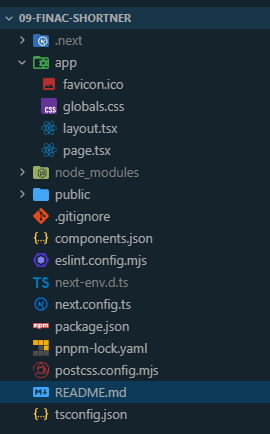
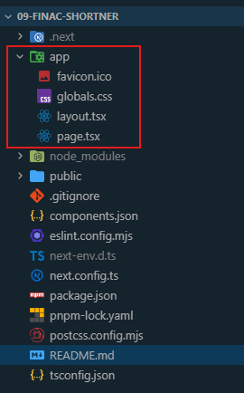

# Project setup command

## Create a Next.js Project (with pnpm)

Use this command to install nextjs application

```pnpm
pnpm create next-app@latest
```

After runnin this command install all node modules. Then setup basic page.tsx and layout.tsx file.

### page.tsx

```tsx
export default function Home() {
  return (
    <div className="flex min-h-screen items-center justify-center bg-zinc-50 font-sans dark:bg-black">
      Home Page
    </div>
  );
}
```

### layout.tsx

```tsx
import type { Metadata } from "next";
import { Inter } from "next/font/google";
import "./globals.css";

const inter = Inter({
  variable: "--font-geist-sans",
  subsets: ["latin"],
});

export const metadata: Metadata = {
  title: "Finac Shortner",
  description: "Finac Shortner is a tool that allows you to shorten long URLs.",
};

export default function RootLayout({
  children,
}: Readonly<{
  children: React.ReactNode;
}>) {
  return (
    <html lang="en" suppressHydrationWarning>
      <body className={`${inter.className} antialiased`}>
        <main className="container mx-auto p-4">{children}</main>
      </body>
    </html>
  );
}
```

## Add Shadcn

Install shadcn using below command

```pnpm
pnpm dlx shadcn@latest init
```

To add shadcn component use below command.

```pnpm
pnpm dlx shadcn@latest add button label input card select
```

## Init Github

Initialize git then commit all changes and create new repo. Then add repo and its name then push the changes to github.

## Project Structure

After doing all above changes our project structure will look like this.



